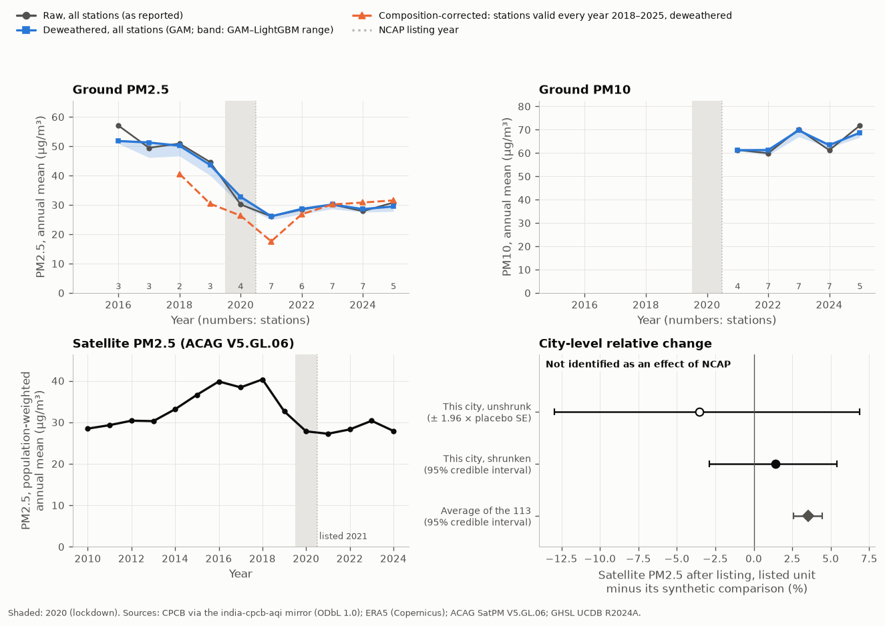

::: {.callout-important}
## Read this first

NCAP units' satellite PM2.5 did not fall relative to comparable units; the estimates point to a relative rise of about 3–5%. H1 is not identified by this design, so this is not an effect of NCAP.

Nothing on this page is an effect of NCAP. City-level numbers come from a Bayesian model that pulls noisy single-city estimates towards the average; cities cannot be ranked from them.
:::

| | |
|---|---|
| NCAP cities in this urban centre | Chennai |
| State | Tamil Nadu |
| Region | Coastal |
| Listed under NCAP (treated from) | 2021 |
| Population 2015 (GHSL) | 10,169,976 |
| New monitor inside the urban centre, 2019–2024 | yes |

{.column-page fig-alt="Four charts for Chennai. Ground data: PM2.5 raw annual mean 57 µg/m³ in 2016 and 31 in 2025; PM10 raw annual mean 61 µg/m³ in 2021 and 72 in 2025. Satellite PM2.5 from 28 µg/m³ in 2010 to 28 in 2024. City-level relative change after listing, shrunken: +1.4% (95% credible interval -2.9 to +5.4); not identified as an effect of NCAP."}

## What the charts show

- **Ground PM2.5 and PM10** (top): the annual mean over every CPCB station inside the urban centre that was valid that year, as reported; the same after removing year-to-year weather (deweathered); and, where some stations were valid every year 2018–2025, those stations alone, deweathered (corrected for weather and for the change in which stations exist). The numbers along the bottom are the stations behind each year.
- **Satellite PM2.5** (bottom left): ACAG V5.GL.06, weighted by where people live. Descriptive.
- **City-level relative change** (bottom right): how this urban centre's satellite PM2.5 moved after listing, against a synthetic comparison built from non-NCAP centres.

## City-level relative change (satellite PM2.5)

| | estimate | 95% interval |
|---|---|---|
| This city, unshrunk (± 1.96 × placebo SE) | -3.6% | -13.0 to +6.9% |
| This city, shrunken (posterior mean; credible interval) | +1.4% | -2.9 to +5.4% |
| Average city-level relative change over the 113 NCAP units | +3.5% | +2.6 to +4.4% |

Relative change = the listed unit minus its synthetic comparison, on log satellite PM2.5, averaged over 2021–2024 (2020 excluded), shown as a %. **Not identified as an effect of NCAP.**

## Data quality

Stations with any data inside the urban centre, including stations not valid that year (the charts count valid stations only), and their median reliability score (0–100: completeness × share of unflagged data, × 0.8 for each failed consistency check).

| year | PM2.5 stations with data | PM2.5 median score | PM10 stations with data | PM10 median score |
|---|---|---|---|---|
| 2015 | 3 | 64.6 | – | – |
| 2016 | 3 | 81.1 | – | – |
| 2017 | 3 | 81.8 | – | – |
| 2018 | 3 | 78.9 | – | – |
| 2019 | 4 | 66.5 | 1 | 53.0 |
| 2020 | 8 | 31.6 | 6 | 9.2 |
| 2021 | 8 | 74.8 | 8 | 70.5 |
| 2022 | 10 | 62.7 | 10 | 78.2 |
| 2023 | 9 | 86.0 | 9 | 82.2 |
| 2024 | 10 | 75.5 | 10 | 74.7 |
| 2025 | 10 | 68.6 | 10 | 59.1 |

Median of the yearly median scores, 2018–2025: PM2.5 71.7, PM10 70.5.

## Downloads

Every number on this page is in the [data downloads](../about.qmd#downloads). [Back to all cities](../index.qmd).
