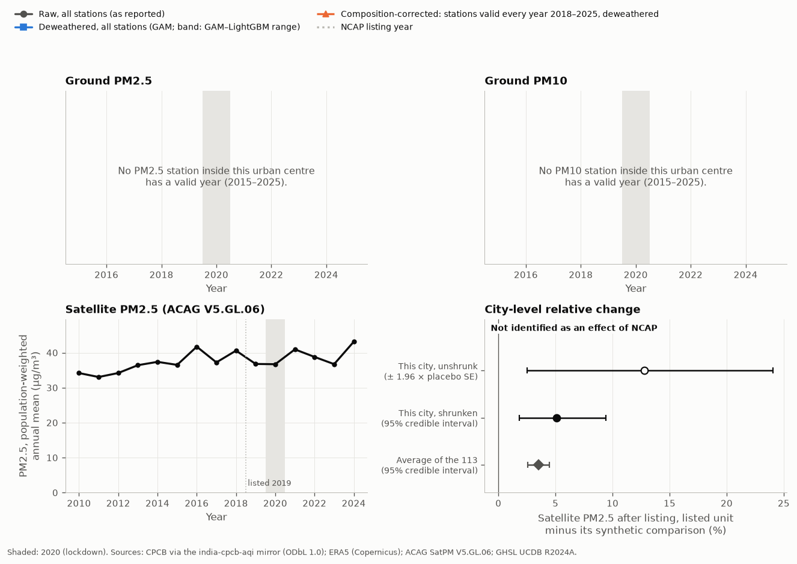

::: {.callout-important}
## Read this first

NCAP units' satellite PM2.5 did not fall relative to comparable units; the estimates point to a relative rise of about 3–5%. H1 is not identified by this design, so this is not an effect of NCAP.

Nothing on this page is an effect of NCAP. City-level numbers come from a Bayesian model that pulls noisy single-city estimates towards the average; cities cannot be ranked from them.
:::

| | |
|---|---|
| NCAP cities in this urban centre | Jammu |
| State | Jammu & Kashmir |
| Region | Peninsular / other |
| Listed under NCAP (treated from) | 2019 |
| Population 2015 (GHSL) | 1,081,371 |
| New monitor inside the urban centre, 2019–2024 | no |

```{=html}
<figure class="figure column-page">
<picture><source media="(max-width: 600px)" srcset="img/jammu-narrow.png"></picture>
<figcaption>Ground and satellite PM2.5 and the city-level relative change for Jammu.</figcaption>
</figure>
```

## What the charts show

- **Ground PM2.5 and PM10** (first two charts): the annual mean over every CPCB station inside the urban centre that was valid that year, as reported; the same after removing year-to-year weather (deweathered); and, where some stations were valid every year 2018–2025, those stations alone, deweathered (corrected for weather and for the change in which stations exist). The numbers along the bottom are the stations behind each year. **This urban centre has no ground station with a valid year.** No station here was valid every year 2018–2025, so there is no composition-corrected series.
- **Satellite PM2.5** (third chart): ACAG V5.GL.06, weighted by where people live. Descriptive.
- **City-level relative change** (fourth chart): how this urban centre's satellite PM2.5 moved after listing, against a synthetic comparison built from non-NCAP centres.

## City-level relative change (satellite PM2.5)

| | estimate | 95% interval |
|---|---|---|
| This city, unshrunk (± 1.96 × placebo SE) | +12.8% | +2.5 to +24.1% |
| This city, shrunken (posterior mean; credible interval) | +5.1% | +1.8 to +9.4% |
| Average city-level relative change over the 113 NCAP units | +3.5% | +2.6 to +4.4% |

Relative change = the listed unit minus its synthetic comparison, on log satellite PM2.5, averaged over 2019 and 2021–2024 (2020 excluded), shown as a %. **Not identified as an effect of NCAP.**

## Data quality

No CPCB station lies inside this urban centre.

## Downloads

Every number on this page is in the [data downloads](../about.qmd#downloads). [Back to all cities](../index.qmd).
