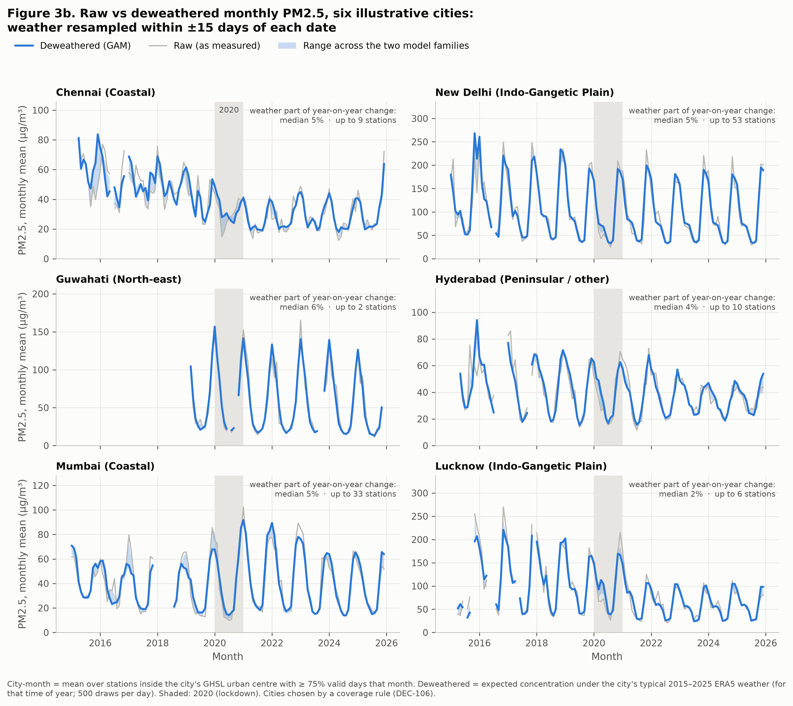
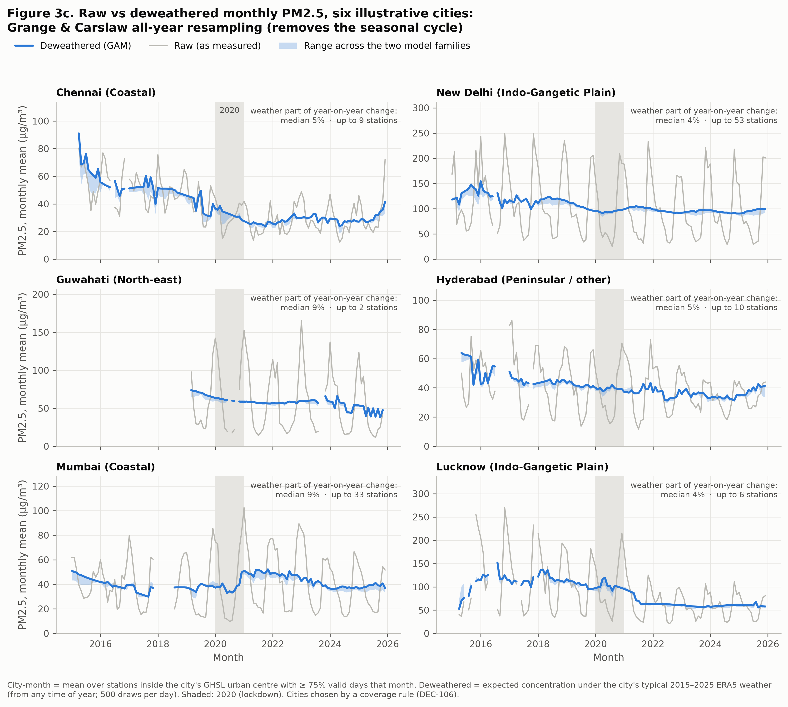
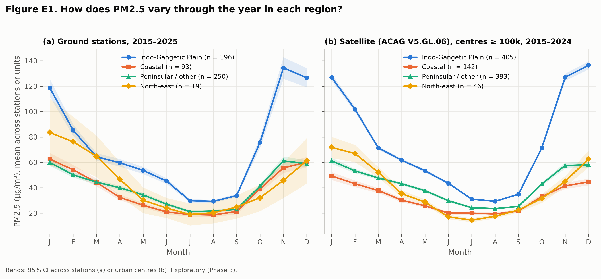
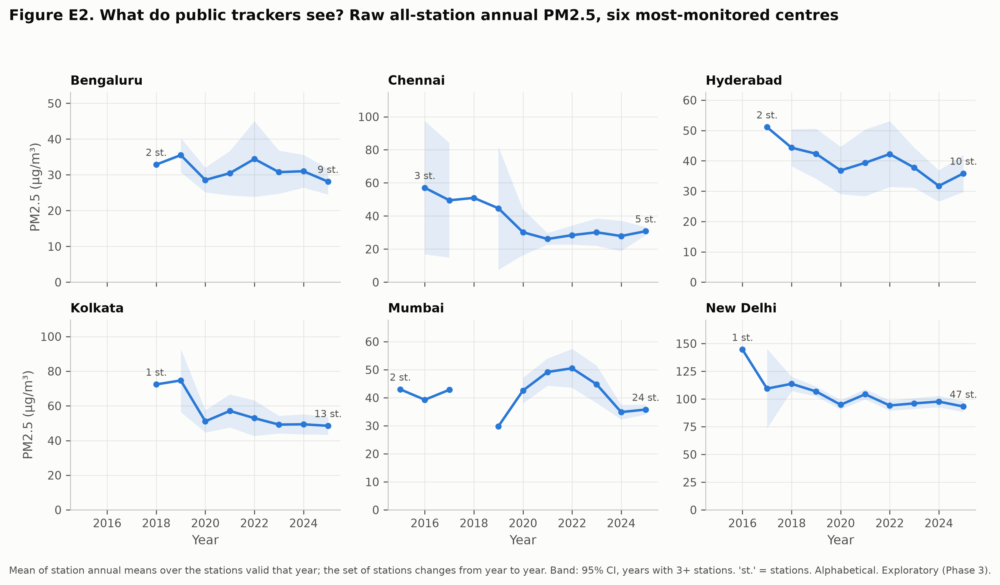
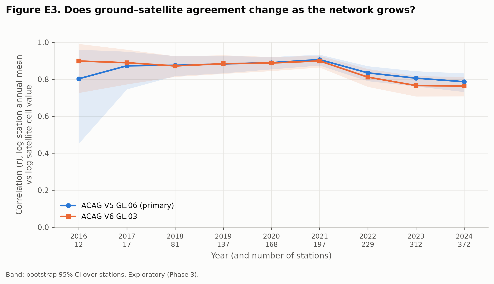
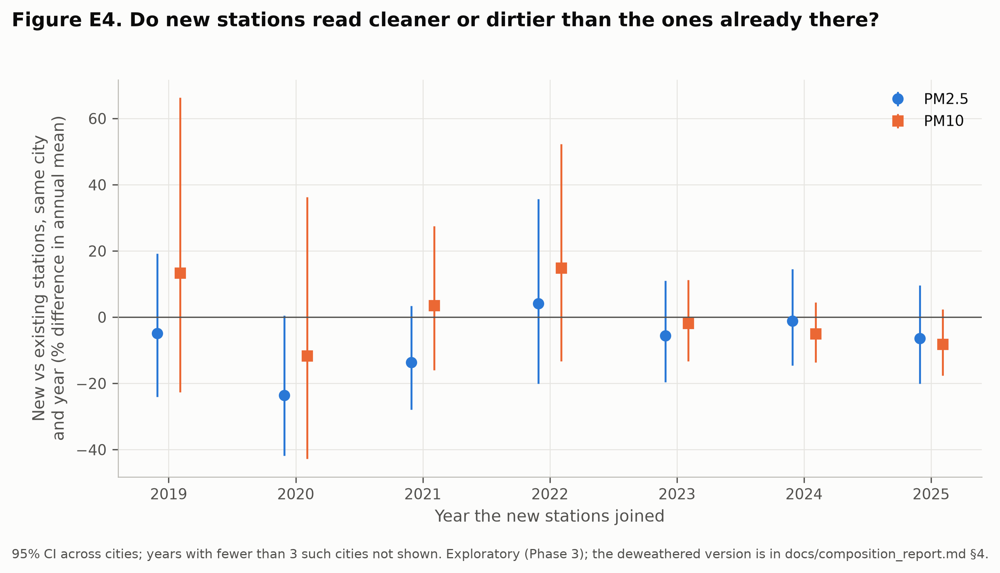

# Figures

*Generated by `python -m src.viz.catalogue` from the sidecars that each figure module writes (DEC-194). Do not edit by hand. Every number in a caption or alt text is formatted from the pipeline outputs the figure draws. Every figure's text, caption and alt text passed the wording check (`src/viz/wording.py`, DEC-193): nothing is called an effect of NCAP (H1 is not identified by this design, DEC-151), and no city is ranked.*

| figure | question it answers | files |
|---|---|---|
| 1 | How much of a city's reported improvement is real? | [PNG](../reports/figures/fig1_decomposition.png), [SVG](../reports/figures/fig1_decomposition.svg) |
| 2 | Did the measuring instrument change under the programme? | [PNG](../reports/figures/fig2_station_entry.png), [SVG](../reports/figures/fig2_station_entry.svg) |
| 3 | How much does weather move annual numbers? | [PNG](../reports/figures/fig3_deweathered_annual.png), [SVG](../reports/figures/fig3_deweathered_annual.svg) |
| 3b | How much does weather move monthly numbers? | [PNG](../reports/figures/fig3_deweathered.png), [SVG](../reports/figures/fig3_deweathered.svg) |
| 3c | How much does weather move monthly numbers? | [PNG](../reports/figures/fig3_deweathered_grange_carslaw.png), [SVG](../reports/figures/fig3_deweathered_grange_carslaw.svg) |
| 4 | Were pre-trends parallel? When did listed and comparison centres diverge? | [PNG](../reports/figures/fig4_event_study.png), [SVG](../reports/figures/fig4_event_study.svg) |
| 5 | Where did satellite PM2.5 rise or fall relative to comparison units? | [PNG](../reports/figures/fig5_city_map.png), [SVG](../reports/figures/fig5_city_map.svg) |
| 6 | How uncertain are city rankings? | [PNG](../reports/figures/fig6_shrinkage.png), [SVG](../reports/figures/fig6_shrinkage.svg) |
| 7 | Is the mechanism consistent with dust control? | [PNG](../reports/figures/fig7_mechanism.png), [SVG](../reports/figures/fig7_mechanism.svg) |
| 8 | How trustworthy is the network over time? | [PNG](../reports/figures/fig8_quality_heatmap.png), [SVG](../reports/figures/fig8_quality_heatmap.svg) |
| S1 | Descriptive context for figure 4 | [PNG](../reports/figures/figS1_levels.png), [SVG](../reports/figures/figS1_levels.svg) |
| S2 | Does the relative rise appear in raw AOD, and the monitor-gain gap? | [PNG](../reports/figures/figS2_aod_acag.png), [SVG](../reports/figures/figS2_aod_acag.svg) |
| S3 | How much of each city's reported improvement is real? | [PNG](../reports/figures/figS3_decomposition_cities.png), [SVG](../reports/figures/figS3_decomposition_cities.svg) |
| S4 | How much of a city's reported PM10 improvement is real? | [PNG](../reports/figures/figS4_decomposition_pm10.png), [SVG](../reports/figures/figS4_decomposition_pm10.svg) |
| E1 | Seasonality by region (exploratory) | [PNG](../reports/figures/eda_seasonal_regions.png), [SVG](../reports/figures/eda_seasonal_regions.svg) |
| E2 | Raw city trends (exploratory) | [PNG](../reports/figures/eda_city_trends.png), [SVG](../reports/figures/eda_city_trends.svg) |
| E3 | Ground vs satellite (exploratory) | [PNG](../reports/figures/eda_ground_vs_satellite.png), [SVG](../reports/figures/eda_ground_vs_satellite.svg) |
| E4 | New vs existing stations (exploratory) | [PNG](../reports/figures/eda_entrants.png), [SVG](../reports/figures/eda_entrants.svg) |

## Figure 1. How much of NCAP cities' reported fall in PM2.5 survives weather and network correction, and how did their satellite PM2.5 move relative to comparison cities?

![Waterfall chart. Across 18 NCAP cities, the reported fall in ground PM2.5 from 2018 to 2025 averages -23.6%; after removing modelled weather and the change in which monitors exist it is -14.1%, so about 40% of the reported fall does not survive correction. Network composition is the largest part (-5.8 pp). Four illustrative cities (Chennai, Hyderabad, Kolkata, New Delhi) show the same steps; in some the correction reverses the sign. On a separate axis, the same cities' satellite PM2.5 rose 3.8% relative to comparison units after listing. That relative change is not identified as an effect of NCAP.](../reports/figures/fig1_decomposition.png)

**Caption.** (a) Mean change in annual ground PM2.5 from 2018 to 2025 over the 18 NCAP cities with a station valid every year (16 of them with only one such station), decomposed in the proposal's order. Reported change (all stations as reported, after the audit's cleaning) -23.6%; removing the part the deweathering model does not reproduce (-0.8 pp), modelled weather (-2.9 pp) and the change in which stations exist (-5.8 pp) leaves a weather- and composition-corrected change of -14.1% (balanced panel, deweathered). Bars: GAM (primary); squares: LightGBM; intervals: 95% cluster bootstrap over cities. H4 (reported fall minus corrected fall) = +9.5 pp (95% CI +4.8 to +14.5). (b) Satellite PM2.5 of the listed units relative to their synthetic comparison units after listing: the 18 cities' units pooled (Phase 7, Layer A restricted) +3.8% (95% CI +1.0 to +6.6), and the shrunken city-level relative change of each illustrative city (Phase 8; 95% credible interval): Chennai +1.4% (-2.9 to +5.4); Hyderabad +5.3% (+1.5 to +9.0); Kolkata +1.6% (-2.7 to +5.7); New Delhi -1.3% (-5.2 to +3.0). This is a different quantity on a different time base from (a), so it is drawn on its own axis and not subtracted. (c) The same decomposition for Chennai, Hyderabad, Kolkata, New Delhi, chosen by a rule on station counts (DEC-191); intervals are station bootstraps where a city has more than one station in a stratum, otherwise none can be estimated and the GAM–LightGBM gap shows the model uncertainty. H1 is not identified by this design (registered pre-trend test failed): not an effect of NCAP.

**Alt text.** Waterfall chart. Across 18 NCAP cities, the reported fall in ground PM2.5 from 2018 to 2025 averages -23.6%; after removing modelled weather and the change in which monitors exist it is -14.1%, so about 40% of the reported fall does not survive correction. Network composition is the largest part (-5.8 pp). Four illustrative cities (Chennai, Hyderabad, Kolkata, New Delhi) show the same steps; in some the correction reverses the sign. On a separate axis, the same cities' satellite PM2.5 rose 3.8% relative to comparison units after listing. That relative change is not identified as an effect of NCAP.

## Figure 2. Did the measuring instrument change under the programme?

**Caption.** (a) The 539 CPCB continuous monitoring stations with a station-level coordinate, by the period of their first PM data: 138 before NCAP (to 2018), 185 in 2019–2021 and 216 in 2022–2025; open circles mark NCAP cities. (b) New stations per year, all 565 stations: 139 first reported in 2015–2018 and 426 from 2019 onward, peaking at 127 in 2023. Most of the network that measures NCAP cities today did not exist at the 2018 baseline, which is why reported city averages mix air-quality change with changes in where monitors stand.

**Alt text.** Map of India with monitoring stations marked by when they first reported: 138 before 2019, 185 in 2019–2021 and 216 in 2022–2025, most of them in or near NCAP cities. A bar chart shows new stations per year, 139 up to 2018 and 426 from 2019, with the peak of 127 in 2023.

## Figure 3. How much does weather move annual PM2.5 numbers?

**Caption.** Raw annual mean PM2.5 (grey) and the deweathered annual mean (blue: weather resampled within ±15 days of each date, the primary scheme; orange dashed: Grange & Carslaw all-year resampling) for six cities chosen by data coverage, one per region first. The band is the range between the two model families (GAM primary, LightGBM). Median weather part of the year-on-year change in the annual mean, per city: Chennai 5%; New Delhi 5%; Guwahati 6%; Hyderabad 4%; Mumbai 5%; Lucknow 2%; the median of these per-city medians over all 171 cities with ground data is 5.3%. 2020 is shaded: its lockdown is an emissions change, not weather, and the one-year-knot trend partly averages it out.

**Alt text.** Six small line charts of annual PM2.5 for Chennai, New Delhi, Guwahati, Hyderabad, Mumbai, Lucknow. In each, the gap between the raw and deweathered lines is that year's weather effect; a typical city's median weather part of a year-on-year change in the annual mean is 5.3%.

## Figure 3b. Raw vs deweathered monthly PM2.5: weather resampled within ±15 days of each date

**Caption.** Monthly raw (grey) and deweathered (blue, GAM) PM2.5 for the six cities of figure 3, with the range between the two model families as a band; weather resampled within ±15 days of each date. Each panel gives the median weather part of the city's year-on-year change in annual means and its largest station count. City-month = mean over stations with at least 75% valid days. Extrapolation guard (DEC-117): 1 of 1875 valid PM2.5 station-years of this family and scheme have a deweathered mean outside 0.67–1.5× the raw mean. 2020 is shaded (lockdown).

**Alt text.** Six monthly PM2.5 time series, 2015–2025, for Chennai, New Delhi, Guwahati, Hyderabad, Mumbai, Lucknow, raw and deweathered. Both keep the seasonal winter peaks, because weather is resampled from the same time of year.

## Figure 3c. Raw vs deweathered monthly PM2.5: Grange & Carslaw all-year resampling (removes the seasonal cycle)

**Caption.** Monthly raw (grey) and deweathered (blue, GAM) PM2.5 for the six cities of figure 3, with the range between the two model families as a band; Grange & Carslaw all-year resampling (removes the seasonal cycle). Each panel gives the median weather part of the city's year-on-year change in annual means and its largest station count. City-month = mean over stations with at least 75% valid days. Extrapolation guard (DEC-117): 1 of 1875 valid PM2.5 station-years of this family and scheme have a deweathered mean outside 0.67–1.5× the raw mean. 2020 is shaded (lockdown).

**Alt text.** Six monthly PM2.5 time series, 2015–2025, for Chennai, New Delhi, Guwahati, Hyderabad, Mumbai, Lucknow, raw and deweathered. The deweathered series loses most of the seasonal cycle, because weather is resampled from any time of year.

## Figure 4. Were pre-trends parallel, and when did satellite PM2.5 in listed and comparison centres diverge?

**Caption.** Event-study estimates of annual population-weighted satellite PM2.5 (ACAG V5.GL.06) in NCAP-listed urban centres minus comparison centres, by year relative to listing (calendar 2020 dropped): Sun & Abraham interaction-weighted coefficients with pointwise 95% CIs (unit and region × year effects, ERA5 covariates, SEs clustered by unit) and Callaway & Sant'Anna dynamic estimates with uniform 95% bands (never-treated controls). Listed units by cohort: 89 (2019), 15 (2020), 9 (2021); 923 never-treated centres. Pre-listing Sun & Abraham coefficients range from -1.6% to +0.8%, but are jointly different from zero (Wald p = 0.0008), so the registered rule (b) fails and H1 is not identified by this design. Average over l = 0 … +5: +3.1% (95% CI +1.7 to +4.5); HonestDiD breakdown M̄ = 0.20. Right: the calendar-2020 coefficient from a fit that includes 2020 (+4.2%). Values are % differences, 100(e^β − 1). Satellite PM2.5 says nothing directly about PM10, NCAP's target pollutant. These are relative changes, not effects of NCAP.

**Alt text.** Event-study chart. Before listing, the yearly differences between listed and comparison centres are small (-1.6% to +0.8%) but jointly significant (p = 0.0008), so the pre-trend test fails. After listing they turn positive, averaging +3.1%: listed centres' PM2.5 did not fall relative to comparison centres. Not identified as an effect of NCAP.

## Figure 5. Where did satellite PM2.5 rise or fall relative to comparison units after listing?

**Caption.** Maps of the 113 NCAP urban centres. (a) Each centre's shrunken city-level relative change in satellite PM2.5 after listing (posterior mean, %; blue = fell relative to its synthetic comparison, red = rose); marker shape gives its 95% credible interval: entirely above 0 for 62, entirely below 0 for 1, spanning 0 for 50. (b) The width of that interval (6.6–9.3 pp). (c) The posterior probability that the relative change is below 0. The average city-level relative change is +3.5% (95% CrI +2.6 to +4.4). Each unit is estimated against its own synthetic comparison (ACAG V5.GL.06, log population-weighted, 2010–2024 without 2020) and pooled with the five registered moderators. No city is ranked or named. These are relative changes, not effects of NCAP: H1 is not identified by this design.

**Alt text.** Three maps of India with one marker per NCAP city. 104 of 113 posterior means are above 0 (red). Satellite PM2.5 in 62 cities rose relative to comparison units after listing with a credible interval above 0, and in 1 it fell with an interval below 0; the rest are uncertain. Interval widths are 7–9 percentage points. Not identified as effects of NCAP.

## Figure 6. How uncertain are city-level relative changes, and their ranks?

**Caption.** (a) For each of the 113 NCAP urban centres, unlabelled and sorted by the shrunken estimate: the unshrunk city-level relative change in satellite PM2.5 after listing (grey, ± 1.96 × its placebo SE, median 0.049 log units) and the shrunken posterior mean with its 95% credible interval (blue). The between-unit SD τ = 0.013 is small against the per-unit SEs, so the estimates shrink strongly towards the average city-level relative change of +3.5%. (b) The 95% interval of each unit's rank among the 113: a median width of 75 places, so the ranks are mostly uninformative. No unit is named. These are relative changes, not effects of NCAP: H1 is not identified by this design.

**Alt text.** Two dot-and-interval charts with 113 unlabelled rows. Unshrunk estimates scatter widely (-12% to +16%); after shrinkage they cluster near the average of +3.5% (-4.4% to +9.0%). The 95% rank intervals are long, a median of 75 of 113 places, so the data cannot rank cities. Unshrunk intervals entirely above 0: 15. Not identified as effects of NCAP.

## Figure 7. Is the ground PM10/PM2.5 pattern consistent with dust control?

**Caption.** (a) Ground estimates for PM2.5 (circles) and PM10 (squares) on the 11 NCAP cities that have both, for the three registered specifications (all stations raw, all stations deweathered, balanced panel) and both Layer B estimators: interrupted time series (after listing minus before) and difference-in-differences against control-pool stations; satellite PM2.5 for the 18 Layer A units with a ground panel is shown for reference (+3.8%). (b) The change in the PM2.5/PM10 ratio on co-located stations: deweathered ITS +4.5% (95% CI -0.0 to +9.2), deweathered DiD +0.6% (-8.7 to +11.7); raw values as hollow markers. Dust control predicts PM10 falling more than PM2.5 and the ratio rising. H3 is inconclusive by its registered rule: condition (iii) already fails (the Layer A vs ITS pair is 'conflict'), and (i) and (ii) fail too. Ground results are secondary, with one pre-year; not effects of NCAP.

**Alt text.** Dot-and-interval charts comparing ground PM2.5 and PM10 changes in 11 NCAP cities across six estimator-specification pairs, and the change in their ratio. The intervals are wide and mostly include 0; the ratio rises by +4.5% in the before-after comparison, with an interval reaching -0.0%, and by +0.6% against control cities. H3 is inconclusive. Not effects of NCAP.

## Figure 8. How trustworthy is the PM2.5 network over time?

**Caption.** (a) The reliability score (0–100) of every PM2.5 station in every year it reported, 562 stations, grouped by region and ordered by first year of data; pale grey cells have no data. (b) The median score over the stations reporting each year, with its interquartile range: 79 over 131 stations in 2018 and 82 over 545 in 2025. The score is 100 × completeness × share of unflagged data, times 0.8 for each failed consistency check (neighbours, satellite, changepoints). It describes data quality; no data are excluded by it.

**Alt text.** Heatmap of 562 PM2.5 monitoring stations by year, shaded by reliability score, showing how the network grew from 30 stations in 2015 to 545 in 2025. A station's first, usually partial, year scores a median 42, against 84 in its later years. A line chart beside it shows the median score: 79 in 2018 and 82 in 2025.

## Figure S1. What happened to satellite PM2.5 in NCAP units and in the control pool?

**Caption.** Mean annual population-weighted satellite PM2.5 (ACAG V5.GL.06, µg/m³) over the 113 NCAP units and the 923 control-pool centres, 2010–2024, unweighted across units, with 95% t-intervals; 2020 shaded. From 2018 to 2024 the NCAP units' mean went from 54.8 to 45.6 µg/m³ (-16.8%) and the pool's from 59.3 to 44.9 (-24.3%): both fell, the pool more. Descriptive: the groups differ in size and region, and no effect is computed from these means.

**Alt text.** Line chart of satellite PM2.5, 2010–2024, for NCAP units and control-pool centres. Both peak in 2016 and fall after 2018; the control pool starts higher and falls further, from 59 to 45 µg/m³, against 55 to 46 for NCAP units, so by 2024 the two are about equal.

## Figure S2. Does a satellite signal that no ground monitor calibrates show the same relative change as ACAG PM2.5?

**Caption.** Relative change of NCAP-listed units against their synthetic comparison in raw MAIAC aerosol optical depth (squares) and in ACAG PM2.5 estimated on exactly the same units (circles), with 95% CIs. Primary: AOD +0.8% (-0.4 to +2.0), ACAG +4.2% (+2.7 to +5.6), read as "rise not reproduced in AOD". Across the 5 specifications, AOD is below ACAG in 5 and its interval lies entirely above 0 in 1 (non-monsoon months). Monitor-gain split: AOD gained +1.2% (-0.2 to +2.7), not gained -0.4% (-2.3 to +1.6), difference +1.6% (-0.8 to +4.0); ACAG on the same units: difference -4.1% (-6.7 to -1.4), read as "gap absent from AOD (consistent with calibration leakage)". Exploratory (DEC-188): ACAG and AOD diverge most in the units that gained no monitor (ACAG +7.1% (+4.7 to +9.6), AOD -0.4% (-2.3 to +1.6)), where calibration leakage cannot act, which weakens Q2 as evidence for leakage specifically. AOD is a column measure, not surface PM2.5, so only its direction is read. These are relative changes, not effects of NCAP: H1 is not identified by this design.

**Alt text.** Paired dot-and-interval chart. In every one of the 5 specifications the raw-AOD relative change is below the ACAG PM2.5 one on the same units (5 of 5); the primary AOD estimate is +0.8% against ACAG's +4.2%. ACAG's smaller rise in units that gained monitors is absent from AOD, and the two signals differ most in units that gained no monitor. AOD is not PM2.5; not effects of NCAP.

## Figure S3. City by city: reported change, the parts removed, and the corrected change

**Caption.** Every NCAP city in H4's scope, listed alphabetically (never ranked): (a) PM2.5, (b) PM10. Each row shows the reported change in the annual mean 2018 → 2025 (thin bar), then removes the unmodelled change, modelled weather and network composition; the diamond is the weather- and composition-corrected change (GAM; line: 95% station bootstrap where the city has more than one station), the square the same with LightGBM. Most cities have one continuous station, so their corrected change is one monitor's record. Ground data only; nothing here is an effect of NCAP.

**Alt text.** Two horizontal bar charts listing 18 PM2.5 and 13 PM10 NCAP cities alphabetically. For each city, bars show the reported 2018-to-2025 change and the parts removed for unmodelled change, weather and network composition, ending at the corrected change. In 4 PM2.5 cities a reported fall becomes a corrected rise. Not effects of NCAP.

## Figure S4. How much of NCAP cities' reported fall in PM10 survives weather and network correction?

**Caption.** (a) Mean change in annual ground PM10 from 2018 to 2025 over the 13 NCAP cities with a PM10 station valid every year (11 with one such station): reported -9.6%; unmodelled change +0.5 pp, modelled weather -5.4 pp, network composition -1.0 pp; corrected -3.6%. H4 = +6.0 pp (95% CI +1.8 to +10.0). GAM bars, LightGBM squares, 95% cluster-bootstrap intervals. (b) Ground difference-in-differences against control-pool cities (Layer B, secondary, one pre-year): +9.2% (95% CI -0.7 to +23.5). There is no satellite PM10. H1 is not identified by this design (registered pre-trend test failed): not an effect of NCAP.

**Alt text.** Waterfall chart for PM10 across 13 NCAP cities: reported change -9.6%, corrected change -3.6%; modelled weather is the largest part removed (-5.4 pp). A separate axis shows the secondary ground comparison with control cities, +9.2% with a wide interval (-0.7 to +23.5). Not identified as an effect of NCAP.

## Figure E1. How does PM2.5 vary through the year in each region?

**Caption.** Monthly mean PM2.5 by region, (a) over ground stations 2015–2025 and (b) over satellite urban-centre values 2015–2024, with 95% intervals across stations or centres. Coastal ground peak in month 1 (63 µg/m³); Indo-Gangetic Plain ground peak in month 11 (134 µg/m³); North-east ground peak in month 1 (84 µg/m³); Peninsular / other ground peak in month 11 (61 µg/m³).

**Alt text.** Two line charts of the seasonal PM2.5 cycle by region, ground and satellite. Every region peaks in month(s) 1, 11, 12 and is lowest in month(s) 7, 8. The Indo-Gangetic Plain is highest in every month in the satellite series.

## Figure E2. What do public trackers see?

**Caption.** Raw all-station annual mean PM2.5 for the six urban centres with the most station-years, in alphabetical order: Bengaluru, Chennai, Hyderabad, Kolkata, Mumbai, New Delhi. Each point averages whichever stations were valid that year, which is what public trackers report before any correction for weather or network composition. Bands: 95% intervals across stations in years with three or more; labels give the station count in the first and last year.

**Alt text.** Six small line charts of raw annual PM2.5 for Bengaluru, Chennai, Hyderabad, Kolkata, Mumbai, New Delhi, with the number of stations growing over the years in each city.

## Figure E3. Does ground–satellite agreement change as the network grows?

**Caption.** Correlation across stations between log station annual mean PM2.5 and log ACAG value of the station's grid cell, by year, for both satellite products, with bootstrap 95% intervals. V5.GL.06: r = 0.80 in 2016 (12 stations) and 0.79 in 2024 (372 stations).

**Alt text.** Line chart of the yearly correlation between ground and satellite PM2.5, from 0.80 in 2016 to 0.79 in 2024, as the number of stations grows from 12 to 372.

## Figure E4. Do new stations read cleaner or dirtier than the ones already there?

**Caption.** For each city-year with both newly opened and existing valid stations, the % difference between the mean annual PM of the new stations and of the existing ones, averaged over cities by entry year, with 95% intervals. Pooled over all city-years, PM2.5: -5.8% (-11.5 to +0.2).

**Alt text.** Dot-and-interval chart by entry year: new PM2.5 stations read below the existing stations in the same city in 6 of 7 entry years shown, each with a wide interval. Pooled over all city-years, PM2.5: -5.8% (-11.5 to +0.2).
