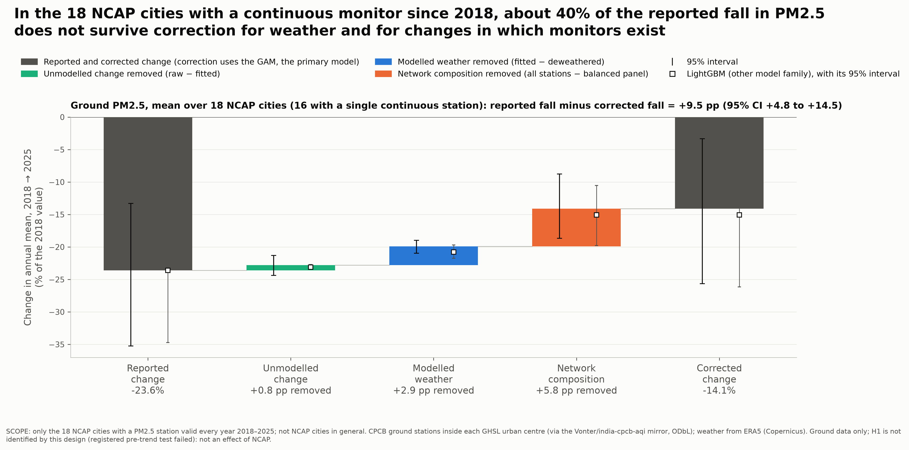

::: {.callout-note appearance="simple"}
## Key messages

- **Reported improvements are overstated.** In the  NCAP cities where at least one monitor could be followed from 2018 to 2025, about  of the reported fall in fine particles (PM2.5) disappears once favourable weather and the arrival of new monitors are taken into account.
- **On average, new monitors stand in cleaner spots.** That alone makes city averages look better, even when nobody's air has changed.
- **NCAP cities got cleaner, but not faster than comparable cities.** Satellite measurements show fine particles fell after 2018 both in NCAP cities () and in other cities ().
- **The study cannot say whether NCAP made a difference.** A check I fixed in advance showed the two groups of cities did not move together closely enough before 2019, so the comparison does not isolate the programme.
:::

## Why raw progress numbers mislead

NCAP, launched in January 2019, set targets for cutting particulate pollution in  cities. Progress is usually judged by comparing a city's measured pollution in a recent year with a baseline year. Three things move that number:

1. **Weather.** A windier or wetter year lowers pollution without any change in emissions. In a typical city, weather alone moves the yearly average by a median  from one year to the next.
2. **Which monitors exist.** Of the  continuous monitoring stations,  first reported in 2019 or later. NCAP set out to expand the network, and its city funds can be spent on it (NCAP report, January 2019; Lok Sabha answer AU5104, April 2022). If new monitors sit in cleaner neighbourhoods, the city average falls even when the air does not.
3. **Policy.** Only what is left after the first two could reflect what cities did.

## What changes when weather and monitors are accounted for

I removed the effect of weather with a statistical model of each monitor's readings, and the effect of changing monitors by following only the stations that measured every year. In the cities where this was possible, the reported fall of  shrinks to . Most of the difference comes from the changing network: newly opened stations read about  cleaner than older stations in the same city and year.

{fig-alt=""}

## Did NCAP cities improve more than other cities?

To answer this fairly, each NCAP city has to be compared with similar cities that were not in the programme. Ground monitors cannot do this, because few existed before 2018. So I used satellite estimates of fine particles for  NCAP urban areas and  similar non-NCAP areas from 2010 to 2024.

- **Both groups improved after 2018, and the NCAP group improved less.** Against a weighted group of similar cities that tracked them before 2019, NCAP cities' satellite PM2.5 was about  higher after listing. In the study's own terms, the programme's effect is not identified by this design.
- **This is not evidence that NCAP made air worse.** Before NCAP began, the two groups did not move together closely enough, so the comparison cannot separate the programme from other differences: NCAP cities are much larger than the comparison cities and less often on the polluted Indo-Gangetic Plain.
- **The satellite figures need care.** They are calibrated against ground monitors, and an independent satellite signal that uses no monitors shows a smaller relative change.
- **No city can be ranked.** City-by-city estimates are too uncertain to say which cities did better or worse.

## Recommendations for measuring progress

1. **Report a fixed set of stations alongside the all-station average,** so that network growth does not show up as improvement.
2. **Report weather-adjusted figures alongside raw ones,** and judge progress over several years rather than one.
3. **Publish when each station opened, moved or changed instruments,** so that others can check the trends.
4. **Track PM2.5 as well as PM10.** NCAP's targets are for PM10, but PM2.5 matters most for health and is what satellites can follow back in time.
5. **Evaluate against comparable cities, with the method fixed in advance,** so that an inconclusive result is still informative.

## About this study

I designed and carried out this study as an independent evaluation, and registered the analysis plan publicly before comparing NCAP with non-NCAP cities after 2018 (<https://osf.io/jksne/>). All data are public. The code, the full technical report, every decision with its date, and a city-by-city explorer are at <https://github.com/breenu/ncap-evaluation> and <https://breenu.github.io/ncap-evaluation/>. Ground data: CPCB, via the `india-cpcb-aqi` mirror (ODbL); satellite PM2.5: Washington University in St. Louis; weather: Copernicus ERA5.
