# Abstract {.unnumbered}

Public progress reports compare a city's raw pollution with a baseline year, and in the cities where I could check this, that comparison overstates the improvement. In the  NCAP cities that had a PM2.5 monitor valid every year from 2018 to 2025 ( of them with only one such monitor), the reported fall of  becomes  once I remove modelled weather and the change in which monitors exist. Most of the difference comes from the changing set of monitors: the stations added since 2018 read cleaner than the ones already there (H4 supported:  percentage points, 95% CI ). Weather alone moves a typical city's annual PM2.5 by about  from one year to the next. For the policy question, I compared the  urban centres containing  of NCAP's  cities with  comparable non-NCAP centres on satellite PM2.5. Satellite PM2.5 fell in both groups after 2018: by  in NCAP units and by  in the comparison pool. NCAP units' satellite PM2.5 did not fall relative to comparable units; the estimates point to a relative rise of about  (primary estimate , 95% CI ). But the pre-trend test I registered in advance failed (p = ), so H1 is not identified by this design, and I do not attribute this or any other number to NCAP. Raw aerosol optical depth, which no ground monitor calibrates, shows a smaller relative change than the satellite PM2.5 product on the same units in every specification, for reasons this design cannot separate. The gap seen in satellite PM2.5 between units that gained a monitor and units that did not is absent from raw aerosol optical depth, which is consistent with, but does not prove, the satellite product absorbing the new monitors. City-level differences are too uncertain to rank cities. The registered tests for a smaller change in the Indo-Gangetic Plain (H5) and for dust control (H3) came out "" and "".

The analysis plan was registered on OSF before any post-2019 comparison was made: <https://osf.io/jksne/>. Code, data provenance and every decision log are at <https://github.com/breenu/ncap-evaluation>, and a city-by-city explorer is at <https://breenu.github.io/ncap-evaluation/>.

::: {.callout-note appearance="simple"}
## What this report does and does not claim

- **H1 is not identified by this design.** My registered pre-trend test failed, so no number in this report is an effect of NCAP. Wherever a satellite estimate appears, the verdict appears with it: 
- **No city is ranked.** City-level estimates are too uncertain to order, and every named list is alphabetical.
- **Ground (Layer B) results are secondary.** They rest on one pre-NCAP year and, mostly, on single monitors; each carries its scope.
- **Raw aerosol optical depth is read for direction only**, because it is not surface PM2.5.
- **No claim is made about any individual weather variable.**
:::

# Introduction {#sec-intro}

## NCAP and how its progress is reported

India's National Clean Air Programme (NCAP) began in January 2019. At its widest it covered  cities that had breached the national standard for particulate matter or have a million or more people; the list current in 2026 has . Its targets are for PM10: reductions of  against a baseline, the last by the financial year that ended in March 2026. Cities receive central money through two channels, the Ministry's NCAP budget ( cities) and performance-linked grants from the XV Finance Commission to million-plus cities ().

Official and independent trackers judge progress by comparing a city's measured concentration in a recent year with its baseline. That comparison mixes three things.

- **Weather.** A windy year or an early monsoon lowers pollution without any change in emissions.
- **Which monitors exist.** NCAP paid for a large expansion of the continuous monitoring network. If new monitors are placed in cleaner neighbourhoods, a city's average falls even if nobody's air changed. The programme changed the thermometer used to judge it.
- **Policy.** Only what remains after the first two could reflect NCAP, and only if the cities that were listed can be compared with cities that were not.

This report separates the three.

## Research questions and hypotheses

- **RQ1, measurement:** how much of a city's reported change comes from data-quality problems and from changes in which stations exist?
- **RQ2, weather:** how much of the year-to-year change comes from meteorology?
- **RQ3, policy:** did PM2.5 change differently in NCAP cities than in comparable non-NCAP cities? This is the confirmatory question.
- **RQ4, heterogeneity and mechanism:** does any change vary with region and funding, and does the PM10/PM2.5 pattern fit dust control?

**Table 1.** The registered hypotheses and their results. Layer A is satellite PM2.5 over urban centres; Layer B is ground monitors.



## Pre-registration

I wrote the analysis plan before comparing NCAP with non-NCAP cities after 2018 and registered it on OSF on 27 September 2026 (<https://osf.io/jksne/>; the registered file is the plan at commit `6e24eca`). The pipeline enforced this in code: every step that estimates a post-2019 comparison checks a gate file and refuses to run while it is shut, and the gate was opened in its own commit (`0d9aa42`) citing the registered plan. Before registering I had seen pre-2019 data, post-2019 series for single cities and regions, and data-quality diagnostics, but no comparison of NCAP with non-NCAP units after 2018. On 1 October 2026 I posted a clarification of how I read some registered rules whose sign was ambiguous. Every departure from the plan is listed, dated and justified in [Appendix A](#sec-deviations).

## What is new here

- A station-level audit of India's continuous monitoring network, with a reliability score for every station-year.
- A systematic measure of network composition: how much the changing set of monitors moves reported city trends.
- Weather normalisation combined with a long satellite pre-period and a comparison group of non-NCAP cities.
- A falsifiable mechanism test (PM10 against PM2.5), and a pre-registered design in which a failed identification check is reported as such.

# Data {#sec-data}

**Table 2.** Data sources. Every raw file is stored unchanged with a manifest of its source, download date and checksum.



## Ground monitors

The ground data are CPCB's continuous ambient air quality stations, 2015–2025. CPCB's own data repository stopped answering during this project, and OpenAQ holds almost no CPCB data for 2023 and 2024, so I used a public mirror of CPCB's repository (Vonter, `india-cpcb-aqi`, ODbL). I did not trust it blindly. Every file matches the checksum the mirror publishes, and its values match OpenAQ's independent copy of the same stations value for value where both exist (2019–2021 and 2025). The mirror stores Indian clock times labelled as UTC; I confirmed the correct offset with three independent tests, including the daily peak of solar radiation at each station. January to March 2026 exists only in OpenAQ's unvalidated real-time feed, so it is not used in any primary result.

The network changed under NCAP (Figure 2). Of the  stations,  first reported by 2018 and  from 2019 onward. The ground record before NCAP is therefore thin: PM10 has  valid station-years in 2017 and  in 2018.

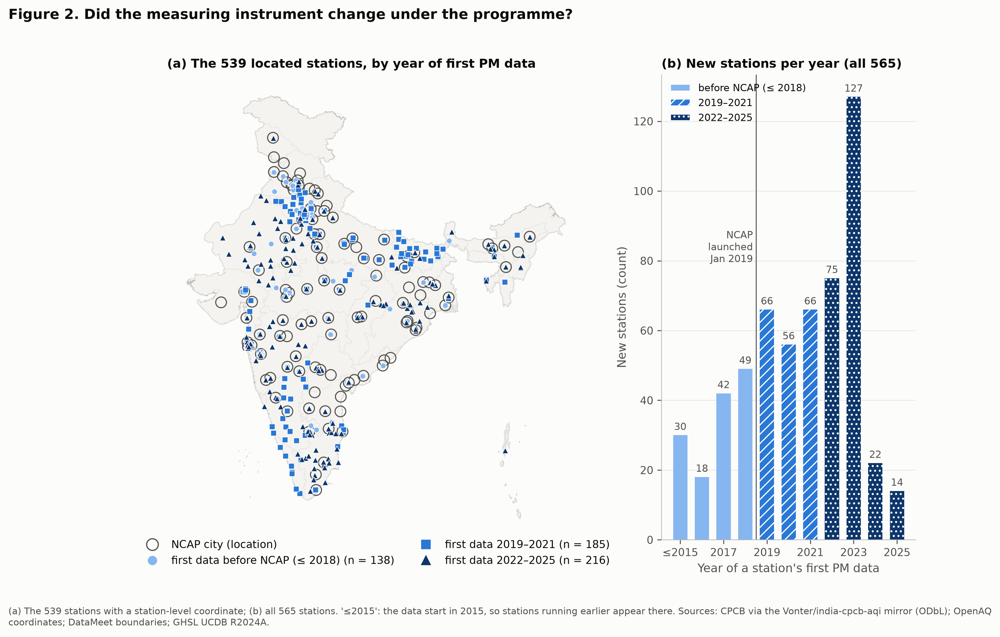{fig-alt=""}

## Satellite PM2.5

The primary outcome is the Atmospheric Composition Analysis Group's satellite-derived surface PM2.5, version V5.GL.06, which is documented and covers 1998–2024. V6.GL.03 (a different algorithm) and V6.GL.02.04 (an earlier calibration vintage) are sensitivity checks. The product is calibrated against ground monitors, so new monitors could leak into it; I test this in @sec-rq3.

## Units, treatment and the comparison group

The unit is a GHSL urban centre (R2024A). A city's satellite value is the population-weighted mean over its polygon, for every unit alike, so that it measures what residents breathe and needs no arbitrary clipping. NCAP cities that share a polygon form one unit (Delhi, Faridabad, Ghaziabad and Noida share one).

- **Treated:**  units holding  of the  NCAP cities. The  NCAP towns with no GHSL centre enter only a sensitivity check.
- **Treatment date:** the first official list containing the city, reconstructed from dated versions of CPCB's list and NCAP documents, every row traced to its source page. Listed by  counts from that calendar year. This gives cohorts of  units (2019),  (2020) and  (2021). The year of first central funding is a sensitivity check only, because XV Finance Commission grants reward cities that improved, so the timing of money is partly an outcome.
- **Comparison pool:** non-NCAP centres with at least  people in 2015, a pre-treatment year:  units.

NCAP units are much larger than the comparison pool (standardised difference in log population ) and less often in the Indo-Gangetic Plain ( against ), but their mean 2010–2018 PM2.5 is similar ( against  µg/m³).

## Weather, fires and aerosol optical depth

Weather comes from ERA5: hourly series at the grid cell of every station, and monthly means for the satellite units. Fires come from NASA FIRMS (VIIRS, from 2012). For the calibration check I reduced raw MODIS MAIAC aerosol optical depth (AOD), a satellite signal that uses no ground monitor, to the same polygons on Google Earth Engine.

# Methods {#sec-methods}

## Audit and validity rules (RQ1)

Every rule is a pure function with a unit test on synthetic data.

- **Impossible values and ceilings.** Values at or below zero are removed. Instrument ceilings (values pinned at the top of an analyser's range) are detected from the network-wide histogram rather than typed in: a value of at least  µg/m³ that is far more frequent than its neighbours at many stations.
- **Flatlines:** identical hourly means for  or more hours.
- **PM2.5 above PM10** at the same station-hour, beyond the larger of  µg/m³ and  of PM10.
- **Level shifts:** changepoints in each station's weekly departure from its neighbours, with the penalty calibrated so that at most  of shuffled series with no shift show one; only steps of at least  count.
- **Spatial consistency:** each station-year against its neighbours within  km and against its satellite cell.
- **Completeness:** a valid day needs  of its hours and a valid year  of its days;  are sensitivity checks.
- **Stuck analysers** (a deviation, A2): a station-year is excluded if its -day variability stays far below its neighbours' for at least  days.
- **Reliability score:** completeness × the share of unflagged data, multiplied by  for each failed consistency check. It describes data quality and excludes nothing.
- **Missingness:** linear probability models of a station-day being missing, by season and by the pollution level the neighbours recorded that day.

## Deweathering (RQ2)

For each station and pollutant, a model predicts daily log PM from that day's weather, the calendar and a slow trend that stands for emissions (Grange and Carslaw's method). The model then predicts each day  more times with weather drawn from other days and averages, giving the concentration expected under typical weather. Only weather is resampled; the trend stays.

- **Two model families:** a GAM (R `mgcv`) whose trend has knots exactly one year apart, so that it cannot follow seasons or single weather episodes (deviation A3), and LightGBM.
- **Resampling scheme:** weather is drawn from ERA5 days within ± days of the same date in any year 2015–2025 (deviation A1). Grange and Carslaw's all-year scheme is a sensitivity check.
- **Choosing the family:** the registered rule picks the family with the better median out-of-sample R² under blocked, forward-chaining cross-validation by year. Random splits would be dishonest because pollution episodes last several days.
- **Guards:** I report how often the resampled weather leaves a station's training range, and flag station-years whose deweathered mean is outside  the raw mean.

## Network composition and H4 (RQ1)

For every city I build three annual trends: all stations as reported; a balanced panel of the stations inside the city's polygon that were valid in 2018 and every year to 2025; and satellite PM2.5 over the same polygon. The reported change from 2018 to 2025 then splits exactly into four parts:

reported = unmodelled change + modelled weather + network composition + corrected change.

The corrected change is the deweathered balanced panel. H4 is the reported fall minus the corrected fall, so a positive value means the reported number overstates the improvement. Uncertainty across cities comes from a cluster bootstrap over cities ( resamples). H4 describes NCAP cities with a continuous station only; it is descriptive, not causal.

## Layer A: the satellite comparison (RQ3, confirmatory)

- **Primary estimator:** synthetic difference-in-differences (SDID), estimated per listing cohort against never-treated centres, 2010–2024 with 2020 dropped, and combined by the number of treated units. The standard error comes from  joint placebo replications in which random control sets of the cohorts' sizes are given the cohorts' adoption years.
- **Event study:** the Sun and Abraham estimator with unit and region × year effects and ERA5 covariates, relative years  to ; Callaway and Sant'Anna's estimator as the staggered-adoption check; Rambachan and Roth's HonestDiD bounds on the pre-trends.
- **Decision rules (registered):** H1 is supported only if (a) the SDID estimate is a reduction with a 95% interval below zero, (b) the pre-period event-study coefficients are jointly zero (Wald p > ), (c) a placebo listing in  shows nothing, and (d) the sign holds in Callaway and Sant'Anna, the area-weighted outcome and V6.GL.03. **If (b) or (c) fails, the verdict is "not identified by this design", whatever the estimate.** If the interval included zero, an equivalence test against ± would apply.
- **Minimum detectable effect:** estimated before the gate from placebo listings in  on pre-2019 data only: a  fall, read as an optimistic lower bound.
- **Calibration leakage:** the primary design is re-estimated separately for treated units that gained a monitor inside their polygon in 2019–2024 and for those that did not. A pre-stated rule flags a warning if the difference points to leakage.
- **Raw AOD:** the same design on log AOD, read only for direction against satellite PM2.5 on exactly the same units, with categories written before any AOD value existed.

## Layer B: the ground comparison, and triangulation

Layer B uses the deweathered balanced panels of H4. The interrupted time series (ITS) is each city's mean log level after listing minus before, which with one pre-year is a before–after contrast. The ground difference-in-differences (DiD) compares NCAP stations with stations in control-pool cities, per cohort. Both are secondary. The two layers are never averaged. Layer A restricted to the cities with ground panels is set against each Layer B estimator and classified in a fixed order: uninformative, conflict, consistent, different magnitude. Any category other than "consistent" triggers a registered four-step investigation (network composition, satellite calibration, spatial coverage, deweathering), reported whether or not it closes the gap.

## Heterogeneity and mechanism (RQ4)

- **City-level estimates:** one SDID per treated unit against all controls. Its standard error is the spread of the same estimate when each control in turn is treated as the listed unit.
- **Hierarchical model:** a Bayesian measurement-error model (PyMC;  chains of  draws) pools the city estimates with the five registered moderators: baseline PM2.5, the Indo-Gangetic Plain, log population, coastal location and funding channel. H5 is decided by the IGP coefficient.
- **H3 (dust control)** needs three conditions: the PM2.5/PM10 ratio rises; PM10 falls, and more than PM2.5, in at least two of three specifications for both ground estimators; and the satellite and ground layers do not conflict.
- **Funding dose (exploratory):** city-level changes against XV Finance Commission allocations per person. Allocations rather than releases are used, because releases reward improvement.

**Table 3.** The registered decision rules for H1 and their values. The full list of rules as I read them is in DEC-135 and Appendix A (group C).



# Results {#sec-results}

## The argument in one figure

Figure 1 summarises the report. Panel (a) is RQ1 and RQ2: the reported fall in ground PM2.5 over the H4 cities, and what remains after removing what the model cannot reproduce, modelled weather and the change in which monitors exist. Panel (b) is RQ3, on its own axis because it is a different quantity: how these cities' satellite PM2.5 moved against comparable centres after listing. It is not identified as an effect of NCAP. Panel (c) repeats panel (a) for four cities chosen by a station-count rule that I wrote after seeing every city's result (Appendix A, D5); every city is in Figure S3.

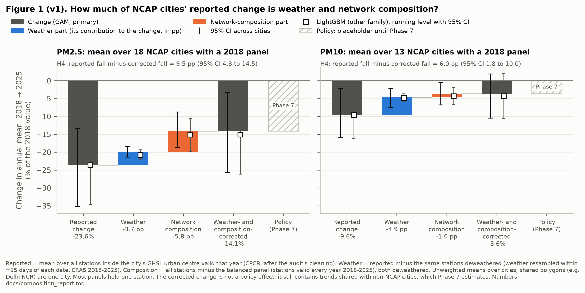{fig-alt=""}

## RQ1: measurement {#sec-rq1}

**The audit.** Ceiling values were found at  µg/m³ for PM2.5 and  µg/m³ for PM10; together with impossible values they remove  of quarter-hour values. Flatlined hours are  to  of hours a year from 2017. PM2.5 above PM10 affects  to  of hours before 2019 but at most  from 2020, a sign that CPCB's own validation tightened. I found  level shifts at  stations; the audit cannot tell a recalibration from a real local change beside a monitor. Most stations track their neighbours closely (median correlation ). The stuck-analyser rule removes  of  valid station-years at  stations. Figure 8 shows the reliability score of every station-year.

**Missing data are not hiding the dirty days.** A station-day is  percentage points less likely to be missing in winter than in the monsoon, and  points less likely on the most polluted third of days, judged by the neighbours. So naive annual means are biased slightly upward, not downward: a median  for PM2.5.

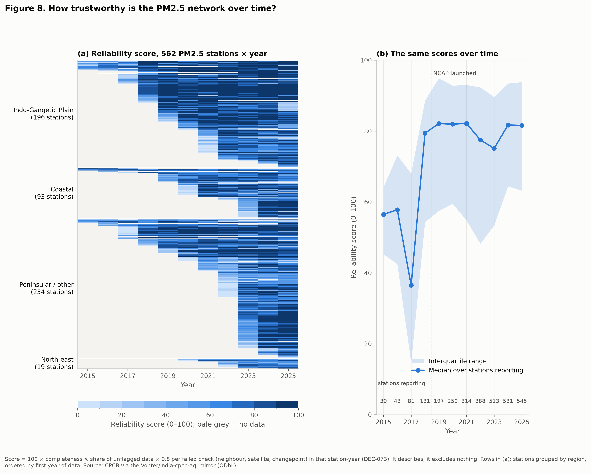{fig-alt=""}

**Network composition moves reported trends.** Across the  cities with a 2018 PM2.5 panel, NCAP or not, the changing set of stations makes the average city look  percentage points better by 2025 than its continuous stations (95% CI ). The gap is near zero until 2021 () and appears from 2022 (, then  in 2023), when the network grew fastest; by 2025,  of these cities measured with a different set of stations than their panel. For PM10 the bias is  points ().

**New stations read cleaner, and not because of weather.** In the same city and year, PM2.5 at newly opened stations is  below the existing stations (95% CI ), and  below after deweathering (); the paired difference is  points (). Weather is shared within a city-year, so it cancels: the gap is about where new monitors stand. PM10 shows no clear gap (, ).

**Ground and satellite agree on average, not city by city.** From 2018 to 2024, the balanced-panel change minus the satellite change averages  points over  cities (), and the two changes correlate at  across cities. Single monitors often fell much more or much less than the satellite says about their whole polygon.

**H4: supported, for both pollutants.** In the  NCAP cities with a PM2.5 station valid every year from 2018 to 2025 ( with a single such station), the reported change of  becomes : about  of the reported fall does not survive correction. Composition is the larger part for PM2.5 ( points of ); for PM10 it is modelled weather ( of ). H4 is supported in  of  versions for PM2.5 and  of  for PM10. The two PM10 versions where it fails are: . The second measures composition alone. The weather part compares two single years, 2018 and 2025, because that is how H4 was registered, and 2025's weather was favourable.

**Table 4.** H4 for PM2.5 and PM10, in the primary version, with LightGBM, and as registered with no deviations. Changes are 2018 to 2025 in %; parts are percentage points of the reported change; H4 = reported fall minus corrected fall. Scope: NCAP cities with a station valid every year 2018–2025, mostly single stations; descriptive, not causal.



## RQ2: weather {#sec-rq2}

The registered rule chose the GAM: its median out-of-sample R² is  against LightGBM's , and it predicts better in  of  series ( series in all). Under the other cross-validation convention the GAM still wins ( against ).

**Weather moves a city's annual PM2.5 by about  a year.** Across  cities, the median year-on-year change in annual PM2.5 is , and its weather part has a median of  ( at the 90th percentile). PM10 is the same (), and so is the all-year resampling scheme (). Network-wide, weather made 2015 a favourable year ( for PM2.5) and 2025 another (). Weather is roughly half of a typical single-year change, so a one-year improvement says little on its own; over several years its push and pull largely cancel.

The two model families agree on average but not always on a single station's trend: they differ by more than  in  of  series. That is why every ground result is shown under both. A pre-set test showed that the 2020 lockdown hardly leaks into neighbouring years under the GAM's trend (median change , below the  threshold), though most of what leaks falls on 2019 ().

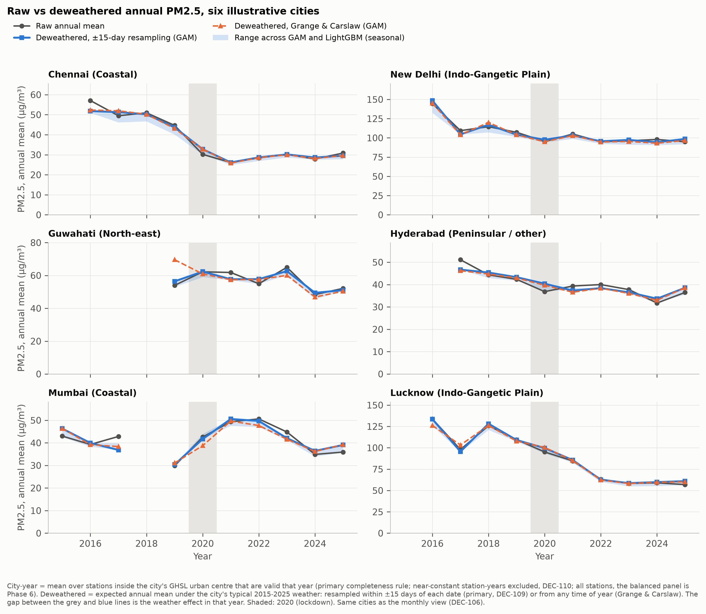{fig-alt=""}

## RQ3: did NCAP cities change differently from comparable cities? {#sec-rq3}

**Verdict on H1: .** 

The primary SDID estimate is  (95% CI ;  µg/m³, ). Rule (b) fails: the pre-listing event-study coefficients are small, but jointly different from zero (χ² = , p = ). Because the satellite series is smooth, small and irregular pre-period wiggles are measured precisely enough to be "significant"; I checked on synthetic panels that the test rejects at its nominal rate when nothing is planted. Rule (c) holds (the  placebo is , ). Every other Layer A estimate is also an increase: Callaway and Sant'Anna , area-weighted , V6.GL.03 , and the event study's average after listing  (). The HonestDiD interval stays above zero only if post-listing departures from parallel trends are at most  times the largest pre-listing one. For information only, since the verdict is already decided: the 90% interval () lies inside ±, and the 95% interval excludes reductions of , NCAP's own targets, although those were set for PM10, not PM2.5.

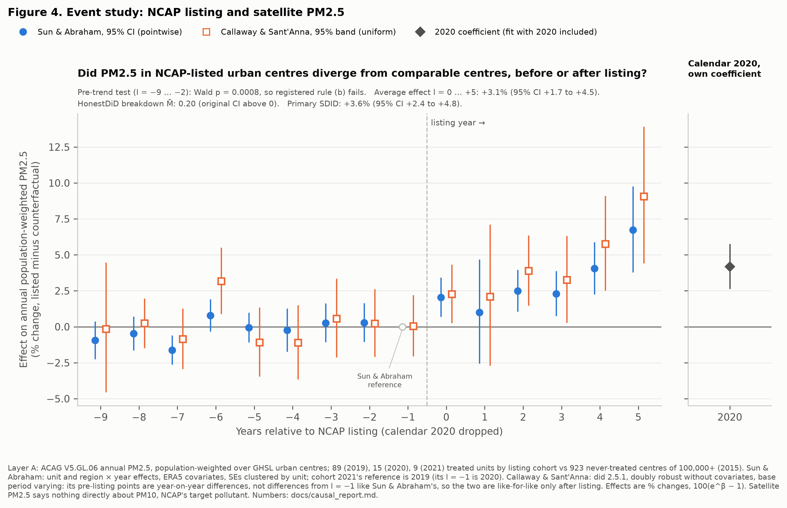{fig-alt=""}

**Why a "relative rise" is not "pollution rose".** Satellite PM2.5 fell in both groups after 2018 (Figure S1): in NCAP units from  to  µg/m³ (), and in the comparison pool from  to  µg/m³ (). NCAP units fell less. The listed cities differ from the pool in ways the design does not fully absorb: they are much larger and less often in the Indo-Gangetic Plain, and excluding that region from both groups lowers the estimate to  (@sec-robustness). Restricting both groups to overlapping population ranges, an exploratory check added after seeing H1, leaves the estimate where it was ( with  treated units;  with ).

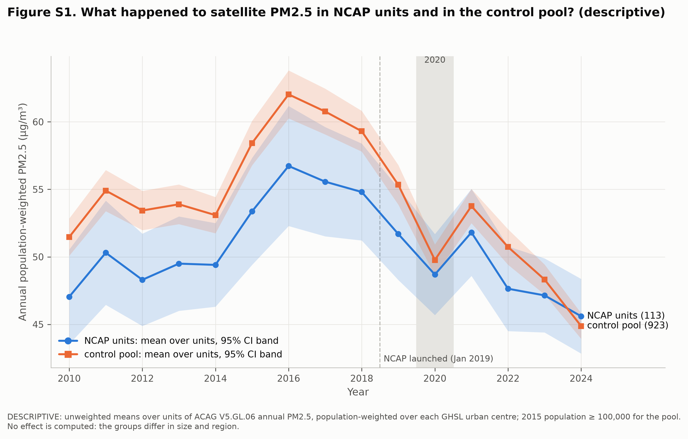{fig-alt=""}

**Could the satellite be echoing the new monitors?** The pre-specified leakage split shows units that gained a monitor rose less () than units that did not (; difference , ), so the registered warning fires. This is the direction leakage would produce, because new monitors read cleaner (@sec-rq1). It is a warning, not proof: the two groups also differ in size and pollution. Raw AOD tests it further (Table 5, Figure S2). On  treated and  control units with a complete AOD record, AOD's relative change is  () against  for satellite PM2.5 on the same units: "". The gained/not-gained gap is absent from AOD: "". These readings were written before any AOD value existed, and they have two limits.

- **The rise is not robust in AOD either way.** A non-monsoon version shows a small rise (, ). In all  AOD specifications the AOD change is below the PM2.5 change on the same units.
- **The divergence is largest where leakage cannot act.** In an exploratory comparison added after seeing these results, the units that gained no monitor show the widest gap ( in satellite PM2.5 against  in AOD). Leakage as hypothesised would pull satellite PM2.5 down where monitors were added, so this weakens Q2 as evidence for leakage specifically. Satellite PM2.5 and raw AOD disagree about NCAP units in general, and this design cannot say why: the satellite product, or a changing link between the aerosol column and surface PM2.5.

The event study on AOD also fails its pre-trend test (p = ), so the pre-trend problem is not only a property of the calibrated product.

**Table 5.** Satellite PM2.5 against raw AOD on the same units. AOD is a column measure, not surface PM2.5, so only its direction is read. Relative changes, not effects of NCAP; H1 is not identified by this design.



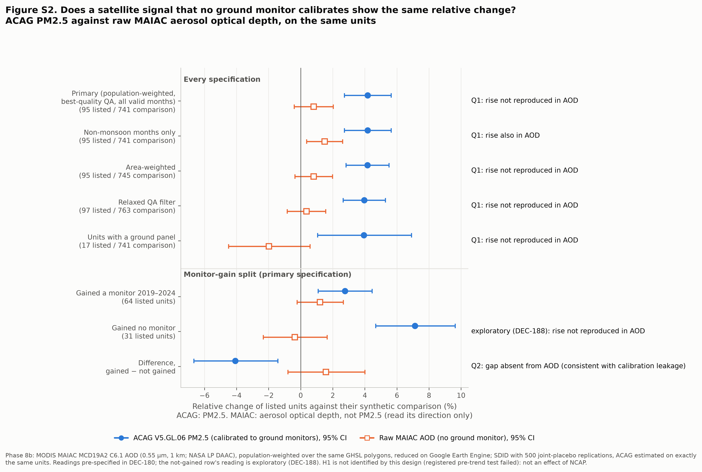{fig-alt=""}

**The ground layer (secondary).** In the  PM2.5 cities ( single-station) the deweathered before–after change is  (), but against  control cities the DiD is  (). For PM10 the ITS is  and the DiD  (). With one pre-year neither can test parallel trends, and the ITS cannot separate national change from anything else.

**Table 6.** Layer B (ground; secondary, one pre-year), deweathered balanced panel, 95% cluster-bootstrap CIs. Not effects of NCAP.



**Triangulation.** Layer A restricted to the same  cities gives  (). Against the ground DiD the pair is ""; against the ITS it is "". The registered investigation resolves the conflict at its third step: over the same cities and years, the satellite's own before–after change is  at the stations' cells and  over the polygons, against  on the ground. Ground and satellite agree that these cities got cleaner. The conflict is between two questions: whether the cities got cleaner (yes), and whether they got cleaner than comparable cities (no). It is not a disagreement between two measurements.

**H2** (a larger winter change) was not tested, because H1 was not supported. As exploratory numbers, winter and non-winter move alike ( and ; difference , ).

## RQ4: heterogeneity and mechanism {#sec-rq4}

H1 is not identified, so every number in this section is a **city-level relative change**: a unit's satellite PM2.5 after listing against its own synthetic comparison. None is an effect of NCAP.

**Single cities are noisy.** The  unit estimates average  and range from  to , but each has a standard error of about  log units.  have an unadjusted p-value below , and  of  survive Benjamini–Hochberg at .

**Pooling.** All  hierarchical models converged at the first attempt. The between-city spread is small ( log units) against each city's noise, so the estimates shrink strongly towards what the moderators predict (Figure 6). The average city-level relative change is  (). Shrunken intervals lie entirely above zero for  units, entirely below for , and span zero for . A typical unit's 95% rank interval spans  of the  places, so the data cannot rank cities; the per-city table in the repository (`docs/heterogeneity_report.md`, §4) and the city explorer are alphabetical for that reason.

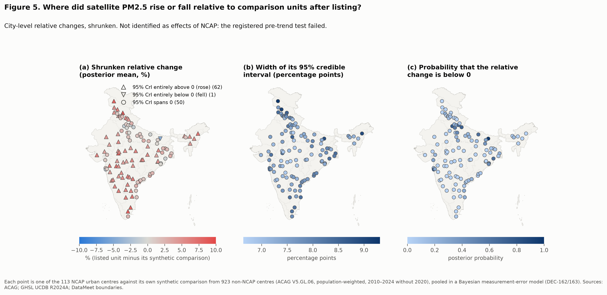{fig-alt=""}

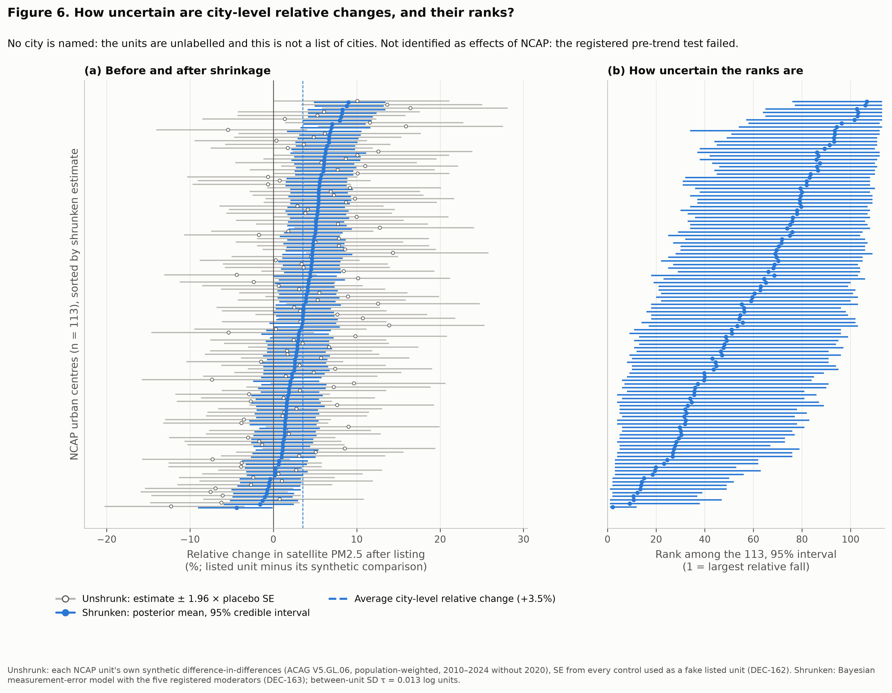{fig-alt=""}

**H5, the Indo-Gangetic Plain: the registered rule is .** The IGP coefficient is  (), which spans zero. A model with the IGP alone, shown beside it and not deciding, gives  (), the opposite direction to H5; the IGP correlates at  with baseline PM2.5, which the full model holds fixed. Among the exploratory moderators, coastal units show a smaller relative change (, ) and XV Finance Commission units a larger one (, ); funding channel and population correlate at , so those two share information. None of this identifies where the programme had any effect.

**H3, dust control: .** Condition (iii) failed before the H3 rules were written, because the ITS pair is "conflict". Condition (i) fails too: the ratio of PM2.5 to PM10 on co-located stations rises by  in the before–after comparison (, an interval that just reaches zero), and by  against control cities (). Condition (ii) holds for the ITS ( of the three specifications) but not the DiD ( of three). The scope is  cities with both pollutants, mostly single stations.

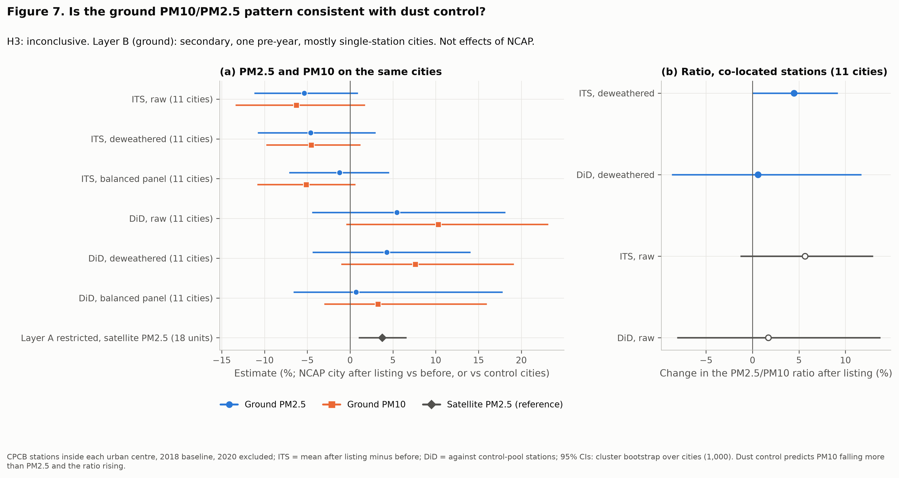{fig-alt=""}

**Funding dose (exploratory).** Across  million-plus units, the city-level relative change moves by  per doubling of the allocation per person (); adding the IGP gives , and dropping the highest-dose unit . The dose is effectively "which state": in the  states with two or more units, allocations per person differ by a median  within a state, while state means run from  to .

# Robustness {#sec-robustness}

**Layer A.**  of  registered checks agree with the primary estimate (same sign, inside its 95% interval), and every Layer A estimate is positive, from  to . The two that do not agree are smaller but still positive: the older calibration vintage V6.GL.02.04 (, , data to 2023) and excluding the Indo-Gangetic Plain (, ). Dropping any single donor moves the estimate only between  and  log units. Adding nearby fire activity as a covariate gives  (), so crop burning does not explain the relative rise.

**Table 7.** Every registered Layer A check. "Agrees" = same sign as the primary and inside its 95% interval; "—" = not on the same scale or a placebo. Relative changes, not effects of NCAP.



**Layer B.**  of  checks agree for PM2.5 and  of  for PM10. Those that do not are the 2019-baseline versions, which cover only the few cities listed in 2020–2021, and versions that change the model or the station set: for PM2.5 the DiD under the as-registered model and at the looser completeness rule, for PM10 both estimators under the stricter valid-hour rule. Excluding 2019, an added check, barely moves the PM2.5 ITS (). The full table is in `docs/causal_report.md` §9.

**H4** holds in every PM2.5 version and all but two PM10 versions (@sec-rq1).

**What weakens the results.**

- The registered pre-trend test fails, so the satellite comparison cannot be read as an effect, whatever its sign.
- The leakage warning fires, and satellite PM2.5 and raw AOD diverge. Part of the relative rise may come from the satellite product or from a changing aerosol–surface link, not from the air people breathe.
- Most ground results describe one monitor per city, and GAM and LightGBM disagree for some single cities.
- Several checks were added after I saw results: excluding 2019, dropping one station (Satna), the population-overlap SDIDs and the AOD comparison where no monitor was added. Each is labelled where it appears (Appendix A, group F).

# Limitations {#sec-limitations}

- **Identification.** NCAP cities were chosen because they were polluted or large. They differ from the comparison pool in size and region, and their pre-listing path differs from their synthetic comparison by enough to fail the registered test.
- **Satellite calibration.** The satellite product is calibrated to ground monitors, and raw AOD, which is not, shows less of the relative rise. AOD is itself a column measure, so neither is a clean reference.
- **A thin ground record.** Before 2018 the network is tiny, so the ground layer has one pre-NCAP year, cannot test parallel trends, and rests mostly on single stations.
- **The wrong pollutant for the target.** NCAP's targets are for PM10; the confirmatory layer measures PM2.5. A PM2.5 result says nothing directly about PM10 attainment.
- **A bundle of actions.** Even an identified estimate would describe being listed, not any particular action.
- **2020.** The lockdown is dropped from the satellite panel and has its own coefficient on the ground; the GAM's one-year trend partly averages it into 2019.
- **Weather at grid scale.** ERA5 cells miss street-level and coastal meteorology, and the deweathered trend depends on the model family for some cities.
- **Provenance.** The ground data come through a mirror of CPCB's repository; I pinned and cross-checked it, but it is one step removed from the source.
- **Not covered.** NO2 (registered as exploratory and not carried out), January–March 2026, and the NCAP towns without a GHSL centre in the primary estimate.

# Conclusion {#sec-conclusion}

Reported improvements in NCAP cities are partly an artefact of how they are measured. Where I could follow a continuous monitor from 2018 to 2025, a large part of the reported fall in PM2.5 comes from where new monitors were placed, and weather moves any single year by about as much as a typical year's change. On satellite PM2.5, NCAP cities improved, but not by more than comparable cities; my registered design cannot say whether NCAP made any difference, because its own pre-trend test failed, and I report that as the result rather than the estimate.

Five recommendations follow from these findings, each within what the data can support.

1. **Report a fixed panel of stations beside the all-station average,** so that network growth does not show up as improvement.
2. **Report weather-normalised values beside raw ones,** and judge progress over several years, not one.
3. **Publish station start dates, moves and instrument changes,** so that composition and level shifts can be checked.
4. **Report PM2.5 as well as PM10,** since health effects and the satellite record are in PM2.5.
5. **Evaluate against comparison cities with a long pre-period, with the analysis registered in advance,** so that a null or unidentified result is as informative as a positive one.



# Appendices {.unnumbered}





## Appendix D. Supplementary figures {.unnumbered}

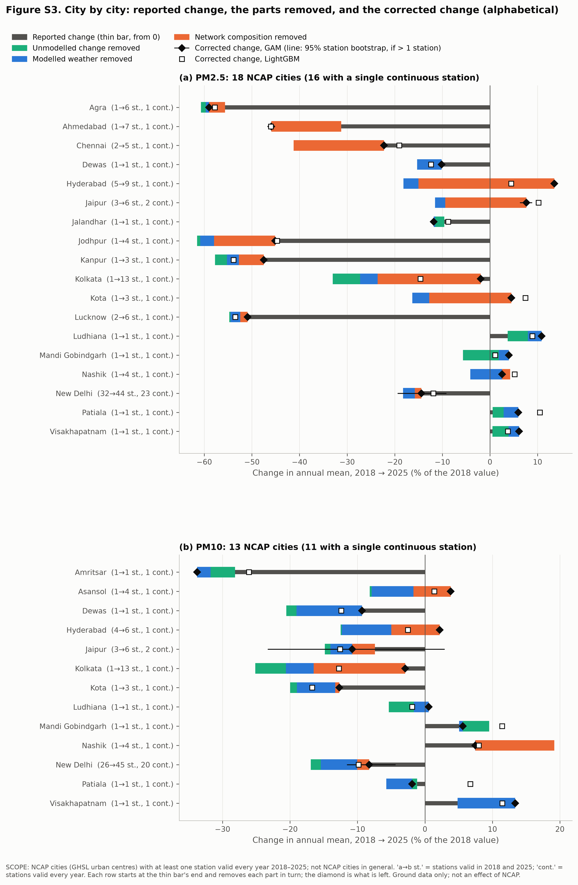{width="78%" fig-alt=""}

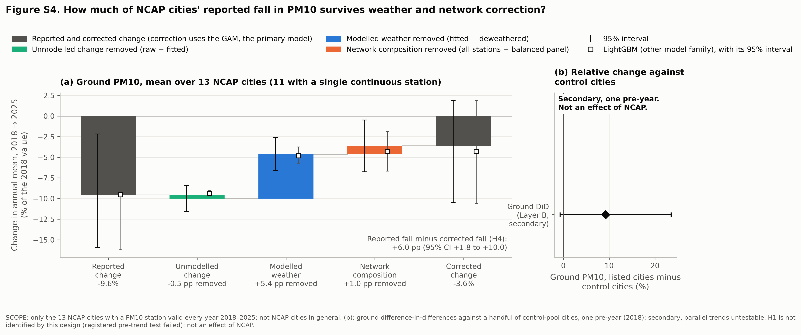{fig-alt=""}
